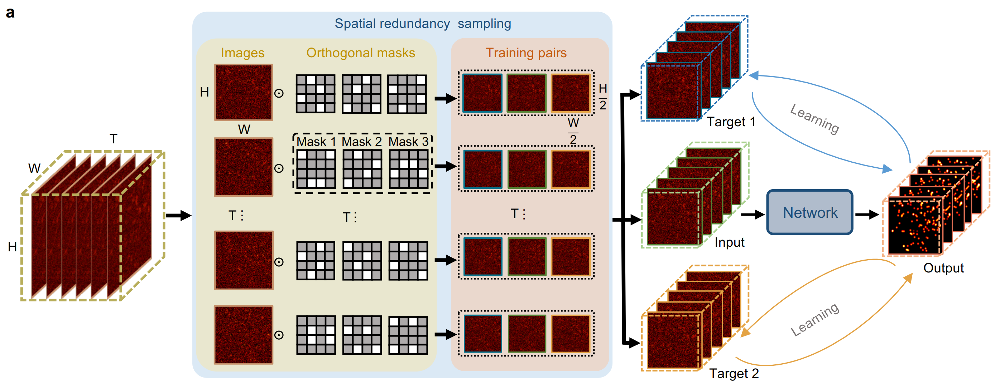
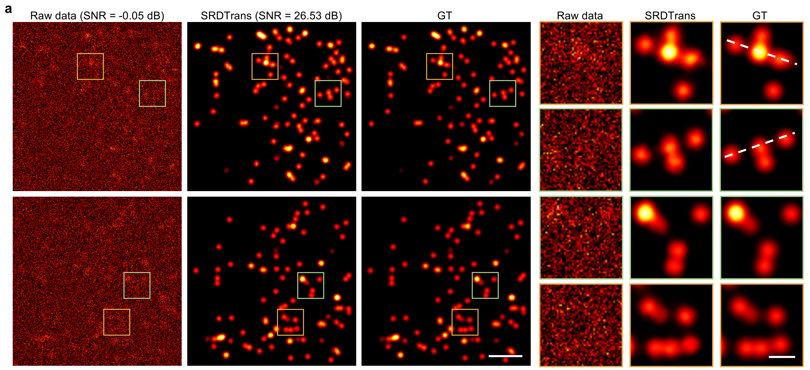
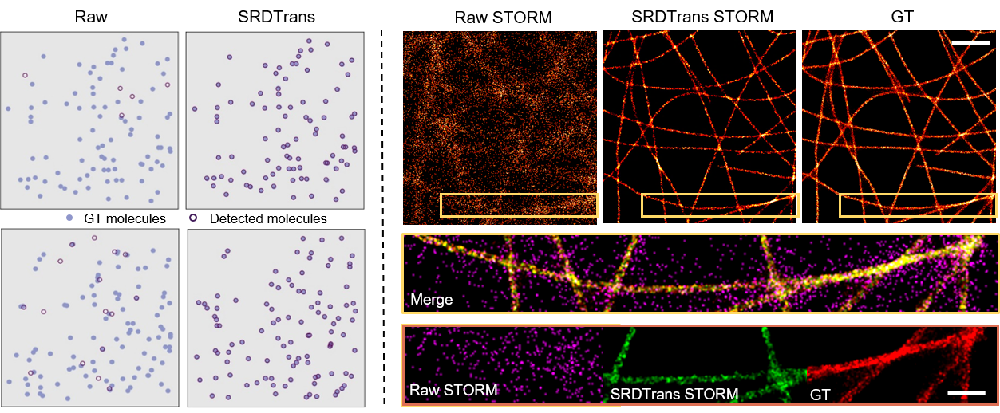
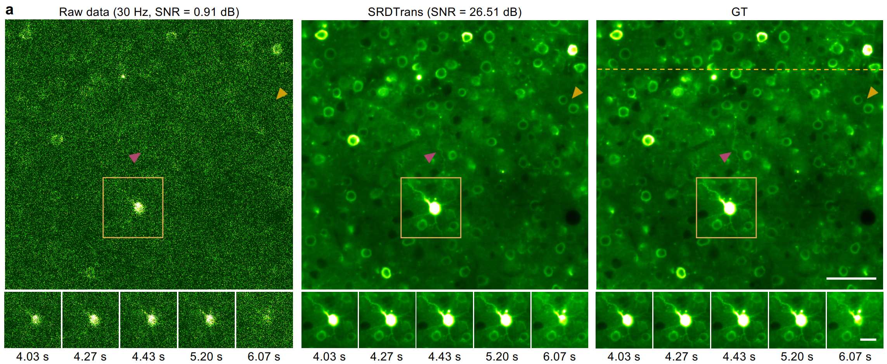
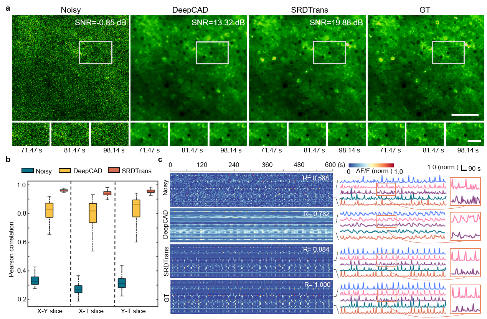
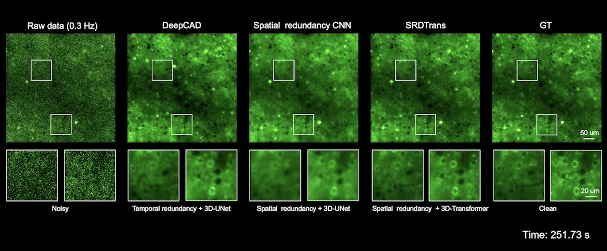
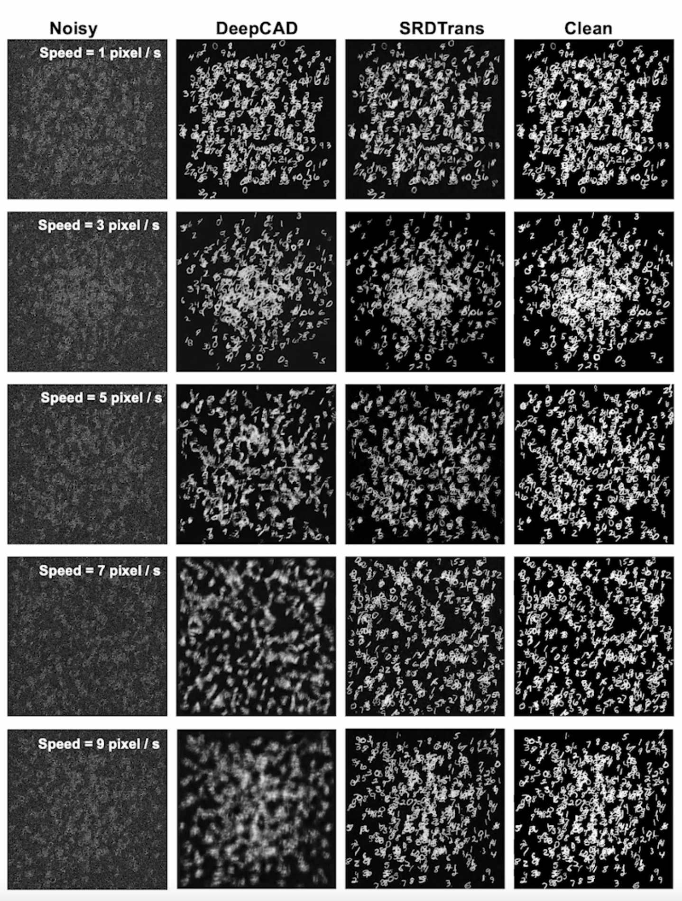

# SRDTrans: Spatial redundancy transformer for self-supervised fluorescence image denoising

<p align="center">
  
</p> 

<div align="center">

✨ [**Method**](#-Method) **|** 🚩 [**Paper**](#-Paper) **|** 🔧 [**Install**](#-Install)  **|** 🎨 [**Datasets**](#-Datasets)  **|** 💻 [**Training**](#-Training) **|** 🏰 [**Model Zoo**](#-Model-Zoo)**|** ⚡ [**Inference**](#-Inference)**|** &#x1F308; [**Results**](#-Results)

</div>

---


## ✨ Method overview

<p align="center">

</p>

We provide a spatial redundancy denoising transformer (SRDTrans) to remove noise from fluorescence images in a self-supervised manner. **First**, a sampling strategy based on spatial redundancy is proposed to extract adjacent orthogonal training pairs, which eliminates the dependence on high imaging speed. SRDTrans is complementary to our previously proposed [DeepCAD](https://www.nature.com/articles/s41592-021-01225-0) and [DeepCAD-RT](https://www.nature.com/articles/s41587-022-01450-8). **Second**, to break the performance bottleneck of convolutional neural networks (CNNs), we designed a lightweight spatiotemporal transformer architecture to capture long-range dependencies and high-resolution features at a low computational cost. SRDTrans can overcome the inherent spectral bias of CNNs and restore high-frequency information without producing over-smoothed structures and distorted fluorescence traces. **Finally**, we demonstrate the state-of-the-art denoising performance of SRDTrans on single-molecule localization microscopy (SMLM) and two-photon volumetric calcium imaging. SRDTrans does not contain any assumptions about the imaging process and the sample, thus can be easily extended to a wide range of imaging modalities and biological applications.


## 🚩 Paper

This repository is for SRDTrans introduced in the following paper:

[Xinyang Li, Xiaowan Hu, Xingye Chen, et al. "Spatial redundancy transformer for self-supervised fluorescence image denoising." bioRxiv (2023)](https://www.biorxiv.org/content/10.1101/2023.06.01.543361v2) 


## 🔧 Install

### Dependencies 
  - Python >= 3.6 
  - PyTorch >= 1.7 
    
### Install

1. Clone the repository and delete placeholder files.

    ```bash
    git clone https://github.com/cabooster/SRDTrans.git
    cd SRDTrans
    rm datasets/noisy/__init__.py pth/__init__.py results/__init__.py
    ```

2. Create a virtual environment and install PyTorch and other dependencies. **In the 3rd step**, please select the correct Pytorch version that matches your CUDA version from [https://pytorch.org/get-started/previous-versions/](https://pytorch.org/get-started/previous-versions/). 

    ```bash
    $ conda create -n srdtrans python=3.6
    $ conda activate srdtrans
    $ pip install torch==1.8.0+cu111 torchvision==0.9.0+cu111 torchaudio==0.8.0 -f https://download.pytorch.org/whl/torch_stable.html
    $ pip install tifffile einops timm tqdm scikit-image
    ```


## 💻 Training 

### 1. Prepare the data  

You can use your own data or download one of the demo data below (*.tif file). The raw low-SNR files should be put into `./datasets/noisy/`.

### 🎨 Datasets

| Data&nbsp;&nbsp;&nbsp;&nbsp;&nbsp;&nbsp;&nbsp;&nbsp;&nbsp;&nbsp;&nbsp;&nbsp;| Pixel&nbsp;size&nbsp;&nbsp;&nbsp;&nbsp;&nbsp;| Frame rate&nbsp;&nbsp;&nbsp;&nbsp;&nbsp;&nbsp;| Size&nbsp;&nbsp;&nbsp;&nbsp;&nbsp;&nbsp;   |Download |         Description                       |
| ---------------------------------------------- |:--------- | :---- | :---- | :---- | :------------------------------------------- |
|Calcium imaging |1.02 μm|30 Hz| 29.2 G   |  <center> Zenodo repository <a href="https://doi.org/10.5281/zenodo.8332083"></a></center>    |   Simulated calcium imaging data with different SNRs      |
|Calcium imaging| 1.02 μm|0.1 Hz, 0.3Hz, 1 Hz, 3 Hz, 10 Hz, and 30 Hz|5.8 G   |   <center> Zenodo repository <a href="https://doi.org/10.5281/zenodo.7812544"></a></center>      |    SRDTrans dataset: simulated calcium imaging data at different imaging speeds|
|SMLM                    |30 nm |200 Hz|  48.0 G     |  <center> Zenodo repository <a href="https://doi.org/10.5281/zenodo.7812589"></a></center>    |    SRDTrans dataset: simulated SMLM data under different SNRs|
|SMLM                    | 43 nm|200 Hz|  23.6 G     |   <center> Zenodo repository <a href="https://doi.org/10.5281/zenodo.7813184"></a></center>    |      SRDTrans dataset: experimentally obtained SMLM data|


### 2. Start training

  ```bash
    # Simulated SMLM & Simulated Calcium imaging data at 30hz
    python train.py --datasets_folder noisy --n_epochs 20 --GPU 0,1 --train_datasets_size 6000  --patch_x 128 --patch_t 128
    
    # Key parameters:
    --datasets_folder: the folder containing your training data (one or more *.tif stacks)
    --n_epochs: the number of training epochs
    --GPU: specify the GPU(s) used for training. (e.g., '0', '0,1', '0,1,2')
    --train_datasets_size: how many patches will be extracted for training
    --patch_x, --patch_t: patch size in three dimensions (xy and t), should be divisible by 8.
  ```

* In the vast majority of cases, good denoising models can be trained with these default parameters. **If not necessary, you do not need to modify these parameters**. You just need to change `--datasets_folder` or `--GPU`. 

* The folders containing training files are in `./datasets`. The checkpoint (model) of each epoch will be saved in `./pth`.

* **Hyperstacks** with multiple channels and even one channel should be split and saved into single-channel stacks. Otherwise, the following error  may occur (`ValueError: num_samples should be a positive integer value, but got num_samples=0`).


## 🏰 Model Zoo
| Models                            | Modality  |Download                                  |
| --------------------------------- |:--------- | :------------------------------------------- |
| SRDTrans                 | Two-photon calcium imaging  |  [Zenodo repository](https://doi.org/10.5281/zenodo.7818030)                                              |
| SRDTrans                 | Single-molecule localization microscopy (SMLM)     |    [Zenodo repository](https://zenodo.org/record/8332544)  

## ⚡ Inference
### 1. Prepare models

Before inference, you should have trained your own model or downloaded our pre-trained model.

### 2. Test models

  ```bash
    # Simulated calcium imaging data sampled at 0.3 Hz
    python test.py --datasets_folder noisy --denoise_model cad_03hz --GPU 0,1 --patch_x 128 --patch_t 128

    # Key parameters:
    --datasets_folder: the folder containing the data to be processed (one or more *.tif stacks)
    --denoise_mode: the folder containing pre-trained models.
    --GPU: specify the GPU(s) used for inference. (e.g., '0', '0,1', '0,1,2')
    --patch_x, --patch_t: patch size in three dimensions (xy and t), should be divisible by 8.
  ```

* In the vast majority of cases, good denoising results can be obtained with these default parameters. **If not necessary, you do not need to modify these parameters**. You just need to change `--datasets_folder`, `--denoise_model` or `--GPU`. 

* For testing, **the patch size in t (`--patch_t`) should be consistent with that used for training**.

* The denoising results will be saved in `./results`. If there are multiple models in `--denoise_model`, only the last one will be used for denoising.

---
## &#x1F308; Results

  ### 1. SMLM denoising
  <p align="center">
  
  </p>

  ### 2. Localization and reconstruction of SMLM
  <p align="center">
  
  </p>

  ### 3. Calcium imaging denoising at 30 Hz
  <p align="center">
  
  </p>

  ### 4. Calcium imaging denoising at 0.3 Hz
  <p align="center">
  
  </p>

  ### 4. Videos
  These are videos and you can click on the pictures to play them.
  
  **1. SRDTrans enhances large-scale volumetric calcium imaging in the mouse cortex**.

  [](https://youtu.be/0IUB8IRyIAM "Please click")

  **2. The denoising performance of different methods on calcium imaging data sampled at 0.3 Hz**.

  [](https://youtu.be/4p7y57EMY14 "Please click")
  **3. Comparing the performance of DeepCAD and SRDTrans on fast-moving objects.** 

  [](https://youtu.be/UpTXmd35Xxs "Please click")

[def]: #-demos-videos
